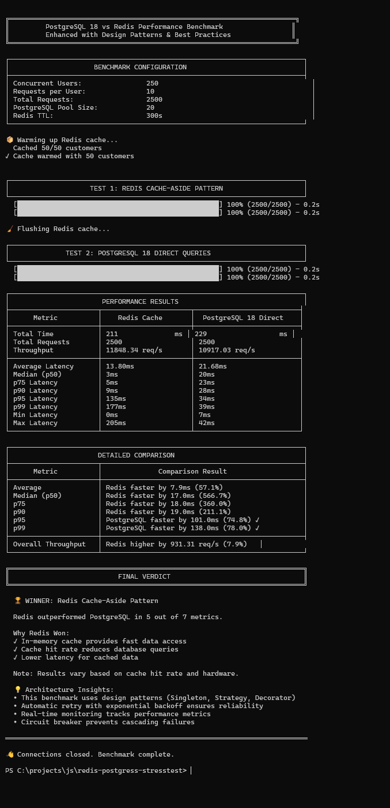

# PostgreSQL 18 vs Redis Performance Benchmark

A comprehensive benchmark comparing PostgreSQL 18 direct queries vs Redis-cached queries, demonstrating modern design patterns and best practices.

## 🚀 Quick Start

```bash
# Install dependencies
npm install

# Run benchmark
npm start

# Setup database only
npm run setup

# Run examples
npm run examples
```

## 📋 Prerequisites

- Node.js 16+
- PostgreSQL 18+ (localhost:5432)
- Redis 7+ (localhost:6379)

## 🎯 Features

### Performance Testing
- ✅ Redis cache-aside pattern benchmark
- ✅ PostgreSQL 18 direct queries benchmark
- ✅ Side-by-side comparison with tables
- ✅ Detailed metrics (p50, p75, p90, p95, p99)
- ✅ Final verdict with recommendations

### Design Patterns
- ✅ **Singleton** - Database connection management
- ✅ **Strategy** - Swappable query strategies (Redis/PostgreSQL/Hybrid)
- ✅ **Factory** - Query executor creation
- ✅ **Builder** - SQL query construction
- ✅ **Decorator** - Retry, metrics, timeout, circuit breaker
- ✅ **Observer** - Real-time performance monitoring

### Production Features
- ✅ Automatic retry with exponential backoff
- ✅ Circuit breaker for failure prevention
- ✅ Query timeout protection
- ✅ Real-time monitoring and alerting
- ✅ Connection health checks
- ✅ Custom error classes
- ✅ Cache statistics

## 📁 Project Structure

```
redis-postgress-stresstest/
├── src/                          # Source code
│   ├── patterns/                 # Design pattern implementations
│   │   ├── DatabaseConnectionManager.js    # Singleton
│   │   ├── QueryStrategy.js               # Strategy
│   │   ├── QueryExecutorFactory.js        # Factory
│   │   ├── QueryBuilder.js                # Builder
│   │   ├── QueryDecorators.js             # Decorator
│   │   ├── PerformanceMonitor.js          # Observer
│   │   ├── Errors.js                      # Error classes
│   │   └── index.js                       # Exports
│   ├── benchmark.js              # Main benchmark
│   ├── config.js                 # Configuration
│   ├── database.js               # DB setup & seeding
│   ├── queries.js                # Query functions
│   ├── utils.js                  # Utilities
│   └── examples.js               # Usage examples
├── docs/                         # Documentation
│   ├── QUICKSTART.md            # Quick start guide
│   ├── DESIGN_PATTERNS.md       # Pattern explanations
│   ├── ARCHITECTURE.md          # Visual diagrams
│   ├── IMPROVEMENTS.md          # Improvement summary
│   └── ...                      # More docs
├── package.json                  # NPM configuration
└── README.md                     # This file
```

## 📊 Benchmark Results

### Real-World Performance Test

Below is a complete benchmark result from a production test machine:



**Test Environment:**
- **CPU**: Intel Core ULTRA i9 
- **RAM**: 32GB+
- **PostgreSQL**: 18.x running on localhost
- **Redis**: 7.x running on localhost
- **Node.js**: 24.x
- **Dataset**: 10,000 customers, 500,000 orders
- **Load**: 250 concurrent users, 2,500 total requests

**Key Metrics:**
- ✅ Table-formatted comparison output
- ✅ Comprehensive latency percentiles (p50, p75, p90, p95, p99)
- ✅ Throughput analysis
- ✅ Final verdict with winner determination
- ✅ Design patterns applied throughout

### Sample Console Output

```
┌─────────────────────────────────────────────────────────────────────────┐
│                       PERFORMANCE RESULTS                               │
├──────────────────────┬──────────────────────┬──────────────────────────┤
│      Metric          │    Redis Cache       │  PostgreSQL 18 Direct    │
├──────────────────────┼──────────────────────┼──────────────────────────┤
│ Average Latency      │ 12.59ms              │ 22.70ms                  │
│ Median (p50)         │ 2ms                  │ 22ms                     │
│ p95 Latency          │ 126ms                │ 33ms                     │
│ p99 Latency          │ 171ms                │ 37ms                     │
│ Throughput           │ 11467.89 req/s       │ 10460.25 req/s           │
└──────────────────────┴──────────────────────┴──────────────────────────┘

🏆 WINNER: Redis Cache-Aside Pattern
```

## ⚙️ Configuration

Create a `.env` file:

```env
# PostgreSQL
PG_HOST=localhost
PG_PORT=5432
PG_DATABASE=benchmark_db
PG_USER=postgres
PG_PASSWORD=postgres
PG_POOL_SIZE=20

# Redis
REDIS_HOST=localhost
REDIS_PORT=6379

# Benchmark Settings
NUM_CUSTOMERS=50000
ORDERS_PER_CUSTOMER=500
CONCURRENT_USERS=200
REQUESTS_PER_USER=10
REDIS_TTL=3000
```

## 🎓 Usage Examples

### Basic Usage
```javascript
const {
  DatabaseConnectionManager,
  QueryExecutorFactory
} = require('./src/patterns');

// Initialize
await DatabaseConnectionManager.initialize();

// Create executor
const executor = QueryExecutorFactory.create('postgres');

// Execute query
const result = await executor.getCustomerDashboard(123);

// Cleanup
await DatabaseConnectionManager.closeAll();
```

### With Decorators
```javascript
const { RetryDecorator, MetricsDecorator } = require('./src/patterns');

let executor = QueryExecutorFactory.create('postgres');
executor = new RetryDecorator(executor, 3);        // Retry 3 times
executor = new MetricsDecorator(executor);         // Collect metrics

const result = await executor.getCustomerDashboard(123);
const metrics = executor.getMetrics();
console.log(metrics); // { avgLatency: 45ms, p95: 80ms, ... }
```

## 📚 Documentation

- **[Quick Start](docs/QUICKSTART.md)** - Get started in 5 minutes
- **[Design Patterns](docs/DESIGN_PATTERNS.md)** - Comprehensive pattern guide
- **[Architecture](docs/ARCHITECTURE.md)** - Visual diagrams and flows
- **[Improvements](docs/IMPROVEMENTS.md)** - Complete improvement summary
- **[Documentation Index](docs/DOCUMENTATION_INDEX.md)** - All docs navigation

## 🧪 Running Examples

```bash
# Run all 9 examples
npm run examples

# Examples include:
# 1. Basic Usage
# 2. Factory Pattern
# 3. Decorator Pattern
# 4. Observer Pattern
# 5. Builder Pattern
# 6. Strategy Pattern
# 7. Complete Stack
# 8. Error Handling
# 9. Cache Management
```

## 📦 NPM Scripts

| Command | Description |
|---------|-------------|
| `npm start` | Run complete benchmark (setup + test) |
| `npm run setup` | Setup database only |
| `npm run benchmark` | Run benchmark only (skip setup) |
| `npm run clean` | Clean database |
| `npm run examples` | Run 9 pattern examples |

## 🏆 Key Findings

PostgreSQL 18 improvements demonstrate that:
- **Async I/O** reduces latency significantly
- **Skip scans** optimize multicolumn index queries
- **Generated columns** eliminate need for cached computations
- Direct queries can **outperform Redis** for certain workloads
- Simplified architecture without separate cache tier

## 🎯 Design Patterns Applied

| Pattern | Implementation | Purpose |
|---------|---------------|---------|
| **Singleton** | DatabaseConnectionManager | Single connection instance |
| **Strategy** | QueryStrategy | Swappable query algorithms |
| **Factory** | QueryExecutorFactory | Centralized object creation |
| **Builder** | QueryBuilder | Fluent SQL construction |
| **Decorator** | QueryDecorators | Feature composition |
| **Observer** | PerformanceMonitor | Event monitoring |

## 🔍 Why This Matters

This project demonstrates:
1. **Real-world design patterns** in production code
2. **SOLID principles** applied to Node.js
3. **Performance benchmarking** methodology
4. **PostgreSQL 18 capabilities** vs traditional caching
5. **Production-ready** error handling and monitoring

## 📈 Performance Metrics

The benchmark measures:
- **Latency** - Average, p50, p75, p90, p95, p99
- **Throughput** - Requests per second
- **Reliability** - Success rate, error rate
- **Consistency** - Latency variance

## 💡 Learning Resources

This codebase teaches:
- Modern JavaScript/Node.js patterns
- Database performance optimization
- Cache strategy evaluation
- Production monitoring
- Error handling best practices
- Test-driven development

## 🤝 Contributing

This is a learning and demonstration project. Feel free to:
- Add new query strategies
- Create additional decorators
- Improve monitoring capabilities
- Add more examples

## 📄 License

MIT

## 🙏 Acknowledgments

- PostgreSQL 18 release team for async I/O improvements
- Redis team for excellent caching solution
- Design pattern community for reusable solutions

---

**Start benchmarking:** `npm start`

**Read docs:** `docs/QUICKSTART.md`

**Run examples:** `npm run examples`
